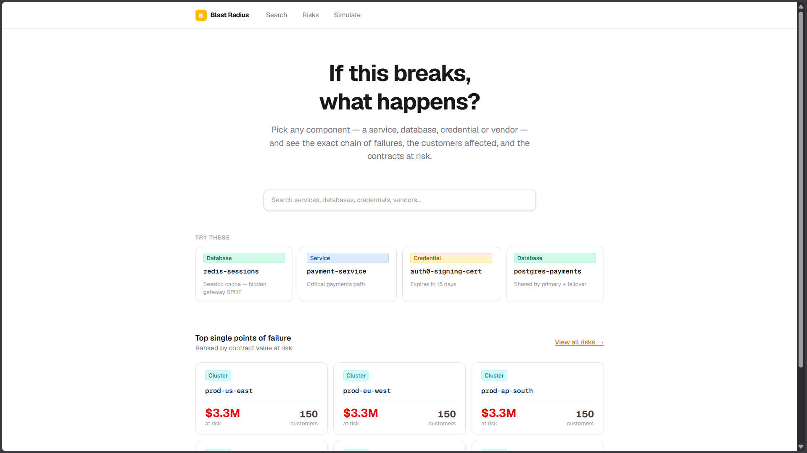
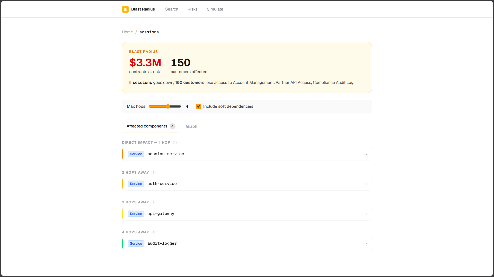
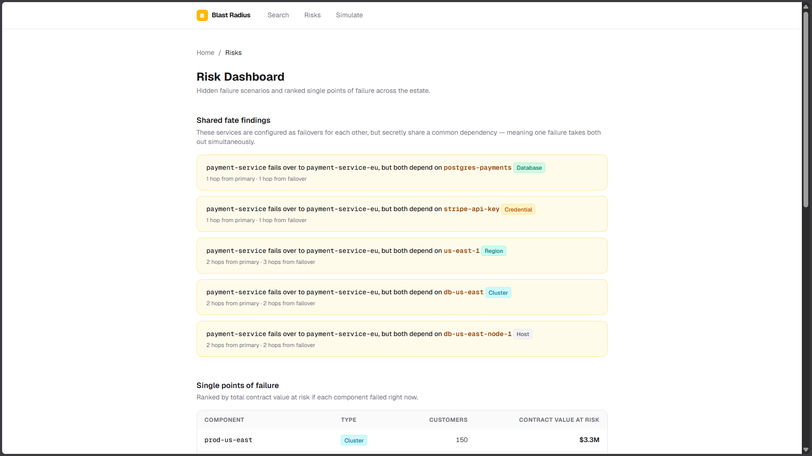
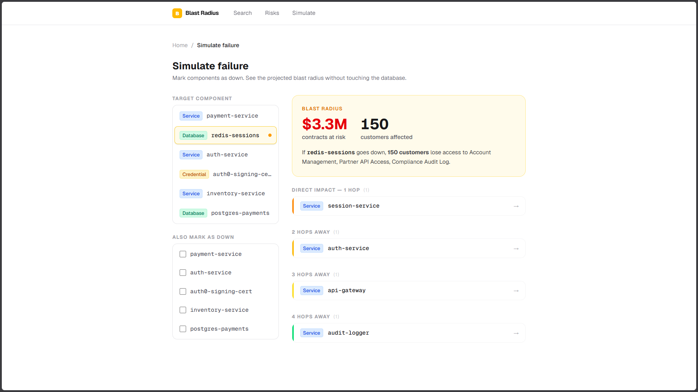
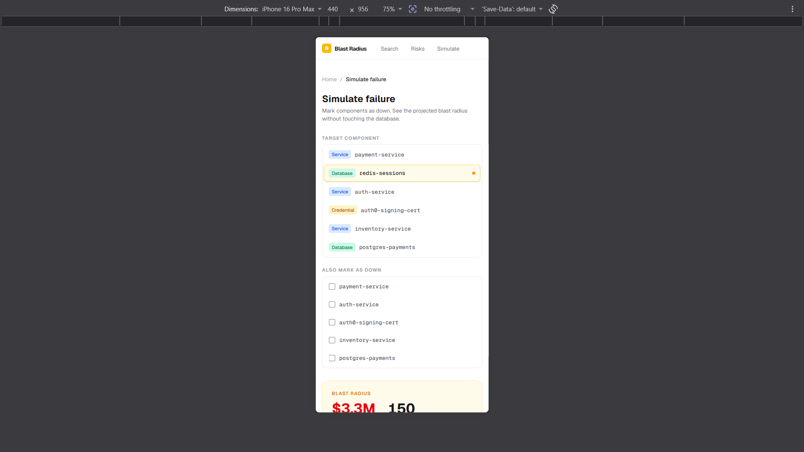

# Blast Radius — Dependency Intelligence

> **[Live demo](https://blast-radius-app.vercel.app)** - hosted on Vercel<br>
> **[Screen recording](https://www.loom.com/share/d9c2d5b7eac94c278d040436237ec851)** - 3-minute walkthrough

Pick any component in your system — a service, database, credential, or vendor. Blast Radius shows you exactly what breaks if it fails: the technical chain of dependencies, the customer-facing features that stop working, and the total contract value at risk.

---

## Screenshots










---

## The problem

A modern online business runs on dozens of interconnected services. When one fails, nobody knows quickly what else goes down, which customers are affected, or how much revenue is at risk. Existing tools like Datadog and Backstage draw a service map — but they stop at the service layer. They tell you "auth-service is down", not who it hurts.

Blast Radius answers the question nobody else answers cleanly: **"If this breaks, what happens?"** — all the way from a Redis cluster outage to the customers who can't check out and the contract value exposed.

---

## What this does that existing tools don't

| Limitation of existing tools | What Blast Radius does instead |
|---|---|
| **Stops at the service layer.** Tells you "auth-service is down", not who it hurts. | Failure propagates all the way to Feature → Customer → Contract. Output is a business sentence with the chain as proof. |
| **Only sees live traffic.** Dormant dependencies — nightly batch jobs, quarterly reports — are invisible, which is exactly when they break. | Dependencies carry an `activeWindow` property. The 3am graph is a genuinely different graph from the 2pm one. |
| **Cannot see shared fate.** Two services look independent, but both sit on the same DB cluster. That hidden correlation is why outages cascade. | A dedicated query finds pairs of "independent" services that meet at a common ancestor. This is the single most impressive demo feature. |
| **Reactive.** Shows the graph after the fire. | What-if mode marks any node as failing without changing the database, turning an incident tool into a planning tool. |

---

## Why a graph database?

### The case in three sentences

The core operations are unbounded-depth traversals across heterogeneous node types — Database → Service → Feature → Customer → Contract. The path itself is the answer (not just the endpoints). And the shared-fate query has no clean relational equivalent at all.

### The shared-fate query: Cypher vs SQL

This query finds two services configured as failovers for each other that secretly share a common dependency — making the failover useless. It is the best illustration of where graphs earn their place.

**Cypher (what we use):**

```cypher
MATCH (a:Service)-[:FAILS_OVER_TO]->(b:Service)
MATCH pathA = (a)-[:DEPENDS_ON|READS_FROM|WRITES_TO|HOSTED_ON|PART_OF|LOCATED_IN|AUTHENTICATES_WITH*1..6]->(shared)
MATCH pathB = (b)-[:DEPENDS_ON|READS_FROM|WRITES_TO|HOSTED_ON|PART_OF|LOCATED_IN|AUTHENTICATES_WITH*1..6]->(shared)
WHERE a <> b
RETURN a.name AS primary, b.name AS failover,
       labels(shared)[0] AS sharedType, shared.name AS sharedResource,
       min(length(pathA)) AS hopsFromPrimary,
       min(length(pathB)) AS hopsFromFailover
ORDER BY hopsFromPrimary ASC LIMIT 50
```

**Equivalent SQL (Postgres):**

```sql
-- Find all ancestors of the primary service (one recursive CTE per relationship type needed)
WITH RECURSIVE ancestors_a AS (
  SELECT to_id AS node_id, 1 AS depth FROM dependencies WHERE from_id = 'svc-payment'
  UNION ALL
  SELECT d.to_id, a.depth + 1 FROM dependencies d
  JOIN ancestors_a a ON d.from_id = a.node_id WHERE a.depth < 6
),
-- Find all ancestors of the failover service
ancestors_b AS (
  SELECT to_id AS node_id, 1 AS depth FROM dependencies WHERE from_id = 'svc-payment-eu'
  UNION ALL
  SELECT d.to_id, b.depth + 1 FROM dependencies d
  JOIN ancestors_b b ON d.from_id = b.node_id WHERE b.depth < 6
)
-- Intersect — nodes reachable from both
SELECT a.node_id, a.depth AS hops_from_primary, b.depth AS hops_from_failover
FROM ancestors_a a JOIN ancestors_b b ON a.node_id = b.node_id
ORDER BY a.depth;
-- This covers ONE relationship type. The real query crosses six types
-- across heterogeneous tables — multiply the complexity accordingly.
```

The Cypher version handles all relationship types, any depth, and heterogeneous node types in 10 lines. The SQL version requires one recursive CTE per relationship type, UNIONed together, then intersected. Realistically it would be 60–80 lines and still less readable.

---

## Data model

See [docs/data-model.md](docs/data-model.md) for the full diagram and property tables.

### Node labels

| Label | Key Properties |
|---|---|
| `Service` | `id`, `name`, `tier` (critical/standard/batch), `language`, `owner` |
| `Database` | `id`, `name`, `engine` (postgres/redis/mongo) |
| `Cluster` | `id`, `name`, `nodeCount` |
| `Host` | `id`, `name`, `type` (vm/pod/bare-metal) |
| `Region` | `id`, `name`, `provider` (aws/gcp/azure) |
| `Credential` | `id`, `name`, `type` (api-key/cert/oauth), `expiresAt` |
| `Vendor` | `id`, `name`, `category` (payments/email/auth/cdn/sms) |
| `Feature` | `id`, `name`, `description`, `userFacing` |
| `Customer` | `id`, `name`, `tier` (enterprise/business/starter), `userCount` |
| `Contract` | `id`, `value`, `renewalDate`, `slaUptime` |
| `Team` | `id`, `name`, `oncallRotation` |

### Three properties that carry the product's value

- **`criticality`** on edges — `hard` means the caller dies without it; `soft` means degraded. Propagation follows only `hard` edges by default.
- **`activeWindow`** on edges — `always`, `business-hours`, `nightly`, `weekly`. Enables the time-aware blast radius.
- **`hasFallback`** on `CALLS_VENDOR` — a vendor with no fallback is a sharper risk on the SPOF ranking.

---

## The queries

See [docs/queries.md](docs/queries.md) for all seven queries with full Cypher and explanations.

| # | Query | What it answers |
|---|---|---|
| Q1 | Blast radius | Everything that breaks, with hop distance — the multi-hop traversal requirement |
| Q2 | Shared fate | Failover pairs sharing a common dependency — the "awkward for SQL" showcase |
| Q3 | Business impact | Customers affected and contract value at risk |
| Q4 | Chain explain | The exact shortest path from cause to effect |
| Q5 | Time-windowed | The 3am graph vs the 2pm graph |
| Q6 | What-if | Project impact of a planned deprecation without touching the database |
| Q7 | SPOF ranking | Which components would hurt most right now |

---

## Setup

### 1. CognoDB instance

1. Create a free account at [console.cognodb.com](https://console.cognodb.com/signup)
2. Create a **c0** (free) instance — pick the nearest region
3. Copy the password immediately — it is shown exactly once
4. Note your connection URI: `bolt+s://your-instance-id.databases.cognodb.cloud`

### 2. Clone and configure

```bash
git clone https://github.com/adithyakrishhna/blast-radius.git
cd blast-radius
git checkout develop
npm install
cp .env.example .env
```

Edit `.env` with your real CognoDB values:

```
COGNODB_URI=bolt+s://your-instance-id.databases.cognodb.cloud
COGNODB_USER=cognodb
COGNODB_PASSWORD=your-password
COGNODB_DATABASE=neo4j
```

### 3. Seed the database

```bash
npm run seed -- --reset
```

Expected output: ~417 nodes, ~1,130 relationships.

### 4. Verify

```bash
npm run verify
```

All 7 queries should return rows. No query should exceed 2 seconds.

### 5. Run locally

```bash
npm run dev
```

Open [http://localhost:3000](http://localhost:3000).

> **Note:** The CognoDB Bolt port (7687) may be blocked on some corporate networks. If `npm run verify` fails to connect, run from a personal machine or network.

---

## Architecture

```
Browser
  └── Next.js App Router (pages + API routes)
        └── src/queries/*.ts   ← Cypher lives here and nowhere else
              └── src/lib/db.ts  ← single driver instance
                    └── CognoDB (Bolt/TLS)
```

### Hosting on Vercel

The app is deployed to Vercel. In production Vercel reuses warm function containers between requests, so the driver singleton in `src/lib/db.ts` is reused across calls on a warm instance — the connection pool is not re-opened per request.

**Important caveat for high-traffic production use:** Vercel serverless functions can run many parallel containers under load, each opening its own driver pool. On a free-tier CognoDB instance capped at 200 connections, this would exhaust the pool. For this assignment's traffic levels Vercel is fine. A long-running host like Render or Railway (which runs a single persistent process) would be the right choice for production.

This trade-off is explicit in the codebase: `src/lib/db.ts` uses a module-level singleton specifically to share one pool within a process lifecycle.

---

## Dataset note

The dataset is **synthetic**, modelled on a typical e-commerce microservice estate (30 services, 12 databases, 8 vendors, 150 customers, 150 contracts). No real production data is used or implied. Five shared-fate risks are deliberately planted in the data — see `scripts/generators/landmines.ts` for documentation of each.

---

## What I'd do next

1. **Real-time activeWindow detection** — automatically determine the current time window from the server clock so the time-aware blast radius updates without user input.

2. **Change detection** — alert when a component's blast radius grows (e.g. a new `DEPENDS_ON` edge makes a previously safe database suddenly customer-facing).

3. **Credential expiry dashboard** — `cred-auth0-cert` and `cred-internal-jwt` both expire in 15 days in the demo data. A dedicated view ranked by `expiresAt` would be a natural addition and a genuine ops tool people would check weekly.
