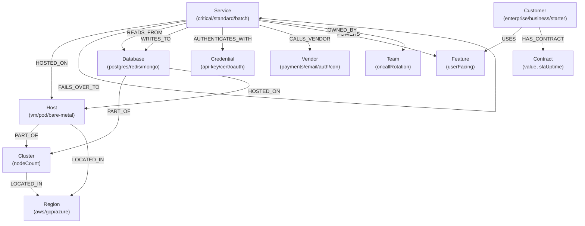

# Data Model

## Overview

The graph models a typical e-commerce microservice estate. Every node is a real thing (a service, a database, a customer). Every relationship is a real dependency. The product answers: **"If this breaks, what else breaks?"**

---

## Diagram

---

## Node Labels

| Label | Key Properties |
|---|---|
| `Service` | `id`, `name`, `tier` (critical/standard/batch), `team`, `language`, `owner` |
| `Database` | `id`, `name`, `engine` (postgres/redis/mongo), `cluster` |
| `Cluster` | `id`, `name`, `nodeCount` |
| `Host` | `id`, `name`, `type` (vm/pod/bare-metal) |
| `Region` | `id`, `name`, `provider` (aws/gcp/azure) |
| `Credential` | `id`, `name`, `type` (api-key/cert/oauth), `expiresAt` |
| `Vendor` | `id`, `name`, `category` (payments/email/auth/cdn/sms) |
| `Feature` | `id`, `name`, `description`, `userFacing` (bool) |
| `Customer` | `id`, `name`, `tier` (enterprise/business/starter), `userCount` |
| `Contract` | `id`, `value` (number), `renewalDate`, `slaUptime` |
| `Team` | `id`, `name`, `oncallRotation` |

---

## Relationship Types

| Relationship | From → To | Key Properties |
|---|---|---|
| `DEPENDS_ON` | Service → Service | `criticality` (hard/soft), `activeWindow`, `protocol` |
| `READS_FROM` | Service → Database | `criticality`, `activeWindow` |
| `WRITES_TO` | Service → Database | `criticality`, `activeWindow` |
| `HOSTED_ON` | Service, Database → Host | — |
| `PART_OF` | Host → Cluster, Database → Cluster | — |
| `LOCATED_IN` | Host, Cluster → Region | — |
| `AUTHENTICATES_WITH` | Service → Credential | `criticality` |
| `CALLS_VENDOR` | Service → Vendor | `criticality`, `activeWindow`, `hasFallback` |
| `POWERS` | Service → Feature | `criticality` |
| `USES` | Customer → Feature | — |
| `HAS_CONTRACT` | Customer → Contract | — |
| `OWNED_BY` | Service → Team | — |
| `FAILS_OVER_TO` | Service → Service | — |

---

## Properties That Carry Product Value

- **`criticality`** — `hard` means the caller dies without it; `soft` means degraded. Blast radius propagation follows only `hard` edges by default.
- **`activeWindow`** — `always`, `business-hours`, `nightly`, `weekly`. The 3am graph is a genuinely different graph from the 2pm one.
- **`hasFallback`** — on `CALLS_VENDOR`. A vendor with no fallback is a sharper risk.

---

## Dataset Note

The data is **synthetic**, modelled on a typical e-commerce microservice estate. No real production data is used or implied. The dataset targets 4,000–7,000 nodes and relationships to stay within the CognoDB free-tier limits (1 GB disk, 0.5 vCPU).
